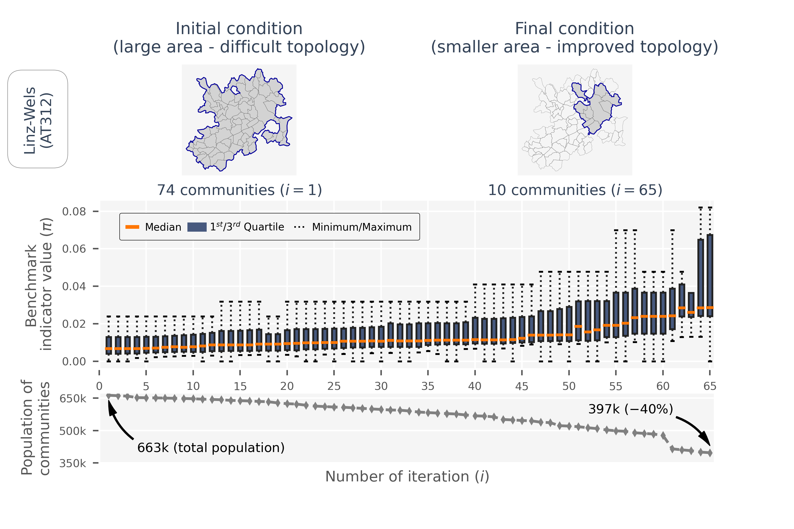

Title and abstract (under construction)

**Downscaling European decarbonization scenarios of the heating sector to the Austrian community level: Assessing the heat density gap of centralized heat networks between 2050 and today**

The core objective of this work is to downscale European deep decarbonization scenarios of the heating sector to the Austrian community level in 2050 to obtain
an estimation of future demand for different heating technologies and infrastructure on smaller geographical scale. We use tailor-made downscaling techniques
accounting for infrastructure needs of heat sources, the network topology of centralized heat networks, and population density projections. The results show
that centralized heat networks play an important role in the highly efficient heat supply of densely populated areas in 2050. However, the projected heat
density of supply areas is significantly lower than today despite high connection rates (in average greater than 85%). We identify a heat density gap of at
least 7.42GWh/km2 considering 10GWh/km2 as today’s minimum required value. We conclude that future yes/no-planning decisions of centralized heat networks should
take enhanced account of the highly efficient use of sustainable and local heat sources in addition to the achievable heat density. Policymakers should en-
sure that building renovation and supply-side efficiency measures in the heating sector do not cause centralized heating networks to lack competitiveness.

